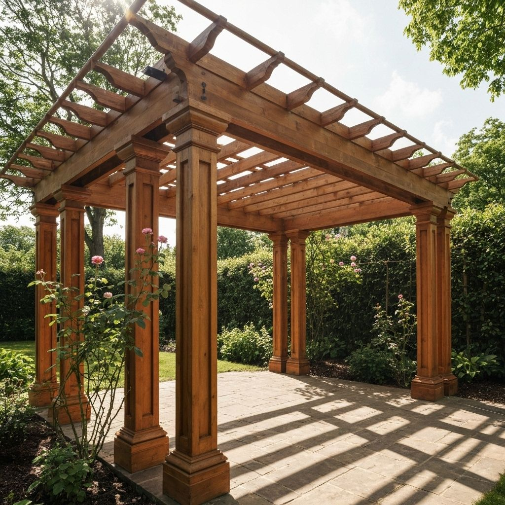

# Wood Construction Company Website

A modern, fully responsive website template for wood construction and carpentry businesses. Built with Next.js, React, and TypeScript.



## Overview

This project showcases a professional website design for wood construction companies, featuring:

- **Pergolas** - Custom outdoor structures
- **Wooden Houses** - Complete construction services
- **Roof Structures** - Wooden roofing solutions
- **Custom Furniture** - Bespoke woodwork
- **Decking** - Luxury outdoor spaces

## Tech Stack

- **Next.js 16** - React framework with App Router
- **React 18** - UI library
- **TypeScript** - Type safety
- **Tailwind CSS** - Styling
- **shadcn/ui** - UI components
- **Radix UI** - Accessible primitives

## Features

- ⚡ Server-side rendering with Next.js
- 📱 Fully responsive design
- 🌗 Dark mode support
- 🖼️ Project gallery
- 📧 Contact form with validation
- 🗺️ Google Maps integration
- ♿ Accessible components
- 🎨 Modern, professional UI

## Getting Started

### Prerequisites

- Node.js 18+ 
- npm or pnpm

### Installation

1. Clone the repository
```bash
git clone https://github.com/pAndreas3/wood-site.git
cd wood-site
```

2. Install dependencies
```bash
npm install
# or
pnpm install
```

3. Run the development server
```bash
npm run dev
# or
pnpm dev
```

4. Open [http://localhost:3000](http://localhost:3000) in your browser

### Build for Production

```bash
npm run build
npm start
```

## Project Structure

```
wood_site/
├── app/                # Next.js app directory
│   ├── page.tsx       # Home page
│   ├── about/         # About page
│   └── projects/      # Projects gallery
├── components/        # React components
│   ├── ui/           # shadcn/ui components
│   ├── header.tsx    # Navigation header
│   └── footer.tsx    # Footer
├── public/           # Static assets (images)
└── lib/              # Utilities
```

## License

MIT License - see [LICENSE](LICENSE) file for details

## Contact

Andreas Palaikythritis - andreas.pale12@gmail.com

Project Link: [https://github.com/pAndreas3/wood-site](https://github.com/pAndreas3/wood-site)
